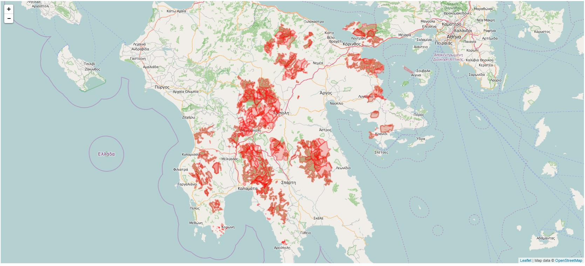
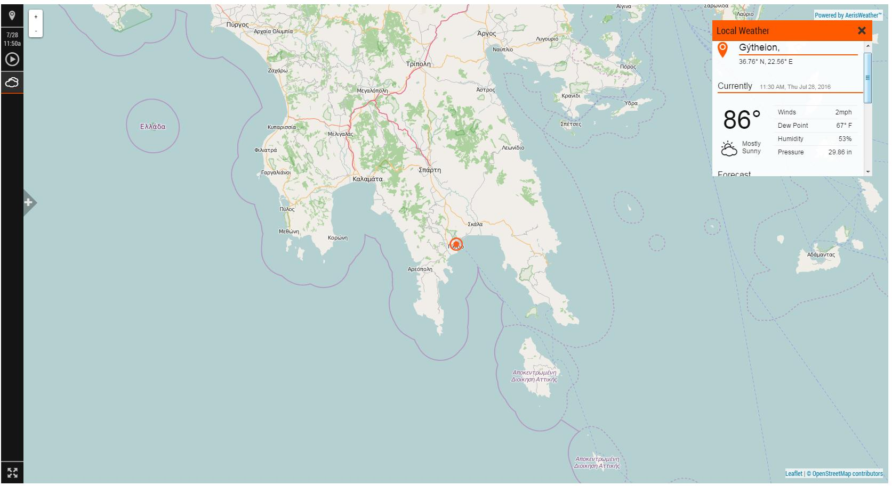
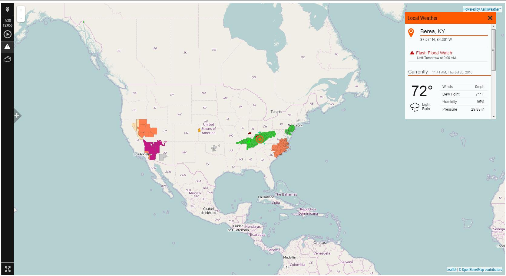

                                               Web  map
    
A Web map app where the user is able to see via specific CSS styles several geographic regions that need to be brought immediately into his attention for ecological importance and interest. In those protected areas mostly endangered species inhabit. 

This app has been made via leafletjs, openstreetmap as tile map server layer and QGIS to build and edit geo data information. Additionally Aerisjs API is used to get weather and advisory data in json format and display them into the tile server map layer via leafletjs.

**map.html**

**weather.html**

**alerts.html**
